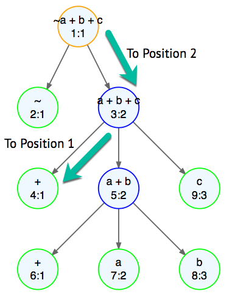
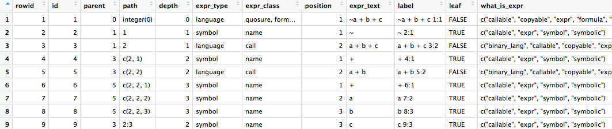

```{r setup, include=FALSE}
knitr::opts_chunk$set(echo = TRUE)
```


>Expressions have lesser ones upon their backs to evaluate 'em. <br>
>Lesser expressions have still lesser ones and so on *ad finitum*.


>Special thanks to @lionel at https://community.rstudio.com/ for pointing out
>that subsetting can used with quosures instead of car and cdr


# Introduction

Quosures enable *Programming on the Language*. This tutorial looks what that
means and how to do it.

*Programming on the Language* is a way of circumventing how R evaluates an
expression in a function argument so that you can evaluate it any way you
want. This is called non-standard evaluation, or NSE, of an argument because
you will not be evaluating it the standard way that R does. A function that
handles some of its arguments this way is a called an NSE function.

*Programming on the Language* is useful because it lets you, in effect, extend
the R language with a custom syntaxes that match a particular problem domain
better than the stardard R syntax does.

Here is a trival example of where R provides syntax that better matches
a problem domain.

This example shows the fundamental way of doing arithmetic in R to sum up 1, 2, 
and 3 using the `+` function. Note that the `+` function takes only one or two
arguments.

```{r dsl1}
# use identity to show the result of the sum
identity(`+`(`+`(1, 2), 3))
```

It's unlikely you have ever done addition this way, it's just too clumsy 
and strange looking compared to the way you learned to do addition in school,
that is use the standard syntax for arithmetic.

By the way, just as an historical note, this is how you would add numbers in
Lisp or in an HP RPN calculator http://www.hpmuseum.org/rpn.htm.

Of course, in practice, you could do this sum as: 

```{r dsl2}
identity(1 + 2 + 3)
```

R doesn't actually know what to do with `1 + 2 + 3` as is. It has translate to
something is does know about, nested `+` functions.

R could use NSE to do this traslation but it doesn't. That's because the
implementors of R we able to include this familiar arithmetic syntax as a
native part of R.

But the important take away from this example is that including this arithmetic
syntax in R didn't extend R's computational capabilities, it just made it
easier to use it in the problem domain of doing arithmetic calculations.

Using quosures to *Program on the Language* lets you do this too...
but without changing the implementation of R, you just write ordinary functions
that use quosues. This way you can make R easier to use in the problem domains
you deal with.

Now let's start looking at how all this works.

For example, assuming `f` is not an NSE function, when R sees
function call like...

`f(tbl, weight < 94)`

... it will at some point end up evaluating the expression in the second
argument and pass TRUE to `f` if the value of the variable `weight` is less
than 94 but otherwise pass FALSE to 'f'. This is called standard evaluation
because that is the standard way R handles arguments in a function call.

The `dplyr::filter` function is an NSE function and evaluates the same syntax
in a completly different way by using quosures.

```{r simplefilter}
suppressPackageStartupMessages(library(dplyr))
tbl <- tibble::tribble(
	~length, ~width, ~weight,
	10, 20, 110,
	15, 10, 87,
	12, 30, 92,
	15, 20, 99
)
# dplyr syntax for choosing rows
filter(tbl, weight < 94, length > 12)
```

`dplyr::filter` doesn't evaluate each argument, like `weight < 94`, individually
as R standard evaluation would. Instead it interprets `weight` and `length` as 
columns of `tbl` and then uses the second and third arguments as predicates
to choose rows from `tbl`.

You can, of course, do the same thing with R standard evaluation, like this:

```{R SE}
tbl[tbl["weight"] < 94 & tbl["length"] > 12, ]
```

and you get the same result.

But the R syntax for chosing rows  
has more of what is sometimes called *programming ceremony*
than the `dplyr::filter` syntax. Programming ceremony is the text you need
to add to an expression that has little to do with telling R what you
want to do.

In the R standard evaluation example the
programing ceremony is `tbl` repeated three times, the quotes and square
brackets and even that one *dangling* comma. All of those things are necessary
to get the R to choose the rows you want but do nothing to clarify what
you want the R to do.

`dplyr::filter` has a syntax with much less ceremony and that is arguably more
straightforward to use. It is also reminiscent of the syntax that SQL
databases use to choose rows.

`dplyr::filter` highlights a key reason making NSE functions... they let you
create a syntax for arguments that is better adapted to accessing data
in a table than standard evaluation and that is similar to the syntax used
to access data in an SQL database that many programmers are
already familiar with.

This tutorial is about using quosures to make NSE functions like
`dplyr::filter`. It also covers the issues you can run into when using
NSE functions. 

#Object Models

In order to *program on the language* you need few things. 

First of all you need some way to prevent R from doing a standard evaluation
of the arguments in a function. There are a number of reasons for this but
the most obvious is that R will often produce errors when given an
expression that wasn't meant to be evaluated.

```{r raw1, error = TRUE}
f1 <- function(expr) {
	as.character(expr)
}

f1(az + bz) 
```

This error occurs because the `'as.character` function uses R do a standard
evaluation of `expr` before it tries to process it. When R did that
evaluation it couldn't find `az`. This is the way most functions in R work.  

You prevent R from doing a standard evaluation by using functions that 
don't use R do a standard evaluation of arguments. 
`rlang::enquo` is one of them.

```{r raw2}
f2 <- function(expr) {
	q <- rlang::enquo(expr)
	rlang::get_expr(q)
}

f2(az + bz) 
```

No errors occured when `f2` was called because the `rlang::enquo` doesn't use
R do a standard evaluation of `expr`. It also returns an object called a 
quosure.

There a number of functions in the `rlang` package that can be used with 
quosures. `rlang::get_expr` is one and it returns the expression object
that is inside the quosure. 

In theory all you need is that literal text of the expression
to interpret the it like `rlang::filter` does with its arguments and
make a custom syntax. We'll
see an example that does this later.

However in
practice the literal text is to hard work with and there
are better ways access the information in the expression, which we'll see as
this tutorial progresses.

One of the key things a quosure gives you access to is an
object model for a quosure. In simple terms an object model is a set of
objects that represent the pieces of an expession.

A quosure tranlates
an expression into an object model. It, in effect, keeps all the pieces of the
object model in a list... which itself might contain lists. We'll see later
that this list of lists is a tree structure.

Here is an example that breaks out the `+` operator 
between `az` and `bz` from expr by using the object model that
a quosure creates:

```{r obj1}
f2 <- function(expr) {
	q <- rlang::enquo(expr)
	ex1 <- q[[2]]
	ex1[[1]]
}

f2(az + bz) 

```
The `f2` function returned the `+` operator from the expression passed into it 
by accessing the list of lists of lists  of the object model in the quosure.

We've complely glossed over the details of how or why `f4` works but we'll get
to them as we go through this tutorial.

The important thing illustrated here is that it is possible for a quosure
to translate an expression into an object module. In programming this is called
*parsing* an expression.

Typically when you *program on the language* you are going to have to parse
expressions. And the really important thing here is that **you** don't have
to write the code that does the parsing... in fact that would be very
difficult to do. A quosure will do all that work for you.

Not only can you break an expression into the pieces that make it up you can
change it too. Here is an example that does that.

```{r obj2}
f5 <- function(expr) {
	q <- rlang::enquo(expr)
	q[[c(2,1)]] <- rlang::sym("-")
	rlang::expr_text(q[[2]])
}

f5(az + bz) 

```

Here, again, we get the `+` operator as it did in the previous
example. But this time we overwrote that operator with the `-` operator. Then
we use the `rlang::get_expr` function we used two examples ago to show what
the new expression looks like.

And you can see here that `f5` has changed `az + bz` into `az - bz`.

In fact we could have completely changed the expression if we wanted to.

Here we have completely glossed over how `f5`	works, but the important thing
that this example illustrates is that by using quosures you can parse and
even modify an expression through the object model the quosure creates.

So far what we've  seen is that *Programming on the Language* means 
inspecting and maybe changing parts of an expression. Quosuers give you access 
to those parts. This is certainly a good, high-level picture of what goes
on in *Programming on the Language*.

This lets you embed your own custom syntax into the arguments of function. And
you do that because your custom syntax is more straightforward and better
matches the problem domain you are working in.

But there is more to *Programming on the Language* than this simple
picture shows.

##Working with Quosures

The syntax of a language determines what you are allowed to type when you
write a program. In R, for example you can type

```{r allowed}
a <- 2
b <- 3
# this is allowed in an R program
a + b
```
and R can understand it and process it. But if you type

```{r notallowed, error=TRUE}
# this is not allowed in an R program
+ a b
```

R won't even try to figure out what you are trying to tell it. This happens
because R checks that the text of your expression complies with the syntax of R
before it tries to do anything else.

This means that the custom syntax you are trying to embed inside an R 
expression must comply with the syntax rules for R.

The syntax of a language can be documented in many ways. For R this is done
in Section 10 of the *R Language Definition* 
https://cran.r-project.org/doc/manuals/r-release/R-lang.pdf .

The syntax of a language like R is meant to give people a familiar way to express
what they want a computer to do by writing an English prose-like list of 
directions. In R each one of these directions is called an expression. A big
factor in how useful a programming language is for a particular task is
its syntax. 

However the computer program cannot directly understand prose of a programming
langauge. The prose has to translated into objects that can be passed into
functions to be processed. The objects are put together in the object model
we were looking at in the previous section.

But now for more details.

##Environments

In most cases, except for quosures, when R sees an expression it
evaluates it and returns one or more numbers that represent the result of
that evaluation. Keep in mind that a string is just a sequence of numbers and
so is an image or a plot.

For example in this trivial R program:

```{r trival}
a <- 2
b <- 3
a + b
```

`a` and `b` are symbols. When R goes to sum up those two symbols it has to somehow
find out what their values are. It does this by looking up the values of
those symbols in the context where that evaluation is being done.

In R this context is called an environment. In fact in R the context may be
sequence of multiple environments that R goes through when it needs, or creates,
the value of a symbol.

R can evaluate a quosure just like it can evaluate an expression in a program.
We'll see how that is done shortly.

A quosure not only includes the object model of an expression it also includes
an evironment that is used when that quosure is evaluated. So a quosure carries
around it's own environment that is used when it is evaluated.

#Quosures in Action

Before we go further let's look
at some examples of quosures in
action. These examples are only meant to show what can be accompished with
quosures.

##Complexity Measure, Using Syntax

Here is a function that measures the complexity of an expression. It's metric is
pretty simple, the longer the expression the more complex it is. However this 
function needs to access the expression string itself
in order to implement this metric and it uses the `rlang::get_expr` function
we saw earlier to get the expression from the quosure. Then is uses the
`rlang::expr_text` function to get the text of that expression.

```{r complexity}
complexity <- function(expr) {
	# make a quosure of the expression
	q <- rlang::enquo(expr)
	# we need the text of the expression to measure it's length
	text <- rlang::expr_text(rlang::get_expr(q))
	# and we return it's length
	stringr::str_length(text)
}

complexity(a)
complexity(a + b)
```

So our `complexity` function shows that `a + b` is five times more  complicated
than `a` :-) .

The important thing shown here is that we were able to access the argument
of `complexity` as a string and then process that string any way we please. 
In this case we just got it length but, of course, we could have done much more 
with it.

However there is limitation here. It's not a deal breaker but in the general case
it's pretty significant. The argument of complexity has to be a string that is
allowed by R's syntax. For example you might like use our `complexity` function to
measure the complexity of a lisp expression like this:
```{r, error=TRUE}
complexity((+ a b))
```

As you can see our complexity function never even got to look at the lisp expression
that was passed into it. That's because in this case what R does when a function
is called is to check that each argument is allowed by the R language syntax.
If one isn't R doesn't go any further and just returns an error.

##Bizzaro World Arithmetic, Using Context

In this example we implement Bizzarro World (
https://en.wikipedia.org/wiki/Bizarro_World ) arithmetic. In
Bizzaro World add means subtract, multiple means divide and *vica versa*.

In this example we will make use of the fact that a quosure includes an
environment that is used when it is evaluated. 

You can get the environment of a quosure by using the `rlang::get_env` 
function. And you can change the environment of a quosure
by using the `rlang::set_env` function.

Changing the environment of a quosure is a little tricky because you can't
just replace it in most cases. You have to, in effect, add one to it. In
most cases the environment used by a quosure isn't private to it, it is
shared by the rest of the code in the script that is using the quosure.

You can evaluate a quosure by using the `rlang::tidy_eval` function.

```{r bizzarro}

barithmetic <- function(expr) {
	# make a quosure
	q <- rlang::enquo(expr)
	# Replace the environment of the quosure with a new one.
	# Make sure the parent of the new environment is the
	# one you are replacing.
	context <- new.env(parent = rlang::get_env(q))
	rlang::set_env(q, context)
	# redefine the arithmetic functions to do bizzarro arithmetic
	# in the new environment that was made for the quosure,
	# so it doesn't change these definitions anywhere else.
	context$`+` <- function(x,y = 0) {x - y}
	context$`-` <- function(x,y = 0) {x + y}
	context$`*` <- function(x,y) {x / y}
	context$`/` <- function(x,y) {x * y}
	# use R to do the evaluation in Bizzarro World
	rlang::eval_tidy(q, context)
}

calc1 <- barithmetic(3 + 1)
# Hmmmm???
calc1
calc2 <- barithmetic(3 * 4 + 1)
#yikes, that's bizzare!!!!
calc2
```

Here we were able to reinterpret the expression passed into `barithmetic` by
manipulating the context to 
substitute bizzarro arithmetic for regular arithmetic. 

Next we're going to change ggplot2 to use non-Euclidian geometry
for it's plots... ha, ha, just kidding :-).

#Object Model

## Inspecting the Object Model

In an earlier example we saw that it was pretty easy to change the `+` to a 
`-` in a the simple expression `az + bz`. What that example glossed over was
how to figure out where the `+` was in the object model.

In fact that highlights one of the issues with quosures, it's hard to *see*
the object model they contain. In theory you can do this by traversing the
object by using subsetting. Here is an example:

```{r traverse1}
q <- rlang::quo(a + b + c)
length(q)
obj1 <- q[[1]]
obj1
obj2 <- q[[2]]
obj2
length(obj2)
obj2_1 <- obj2[[1]]
obj2_2 <- obj2[[2]]
obj2_3 <- obj2[[3]]
rlang::get_expr(obj2_1)
rlang::get_expr(obj2_2)
rlang::get_expr(obj2_3)

```

Here you can see that `q` acts like list. And the objects it contains may act
as lists too. This kind of data structure is called a tree... each object in
the structure contains a list of its children, if it has any.

After some digging you can see we found one of the `+`'s in `a + b + c`. And
you could fix up this script to be more automated.

There are a couple of issues with working this way. One is that typically in R
we don't work with trees and R itself doesn't have a good set of functions 
for working directly with trees. 

Typically, rather than trees, we work with tables in R. If we could turn a
quosure into a table it would be a lot easier to *look* at.

But can a table represent a tree? Sure, here is a made up example.
```{r tree1}
tree_table <- tibble::tribble(
	~id, ~parent, ~label,
	1L, 0L, "X1234",
	2L, 1L, "Y557",
	3L, 1L, "t88",
	4L, 2L, "j111"
)
tree_table
```

The thing that makes this a tree table are the `id` and `parent` columns.
By using this convention we can make our own tools for working with tree tables. 
The functions we about to use are in the downloads for this tutorial and later
we will go into how they work.

We can use `qtls_plot_model` to get a picture of `tree_table` with `DiagrammeR`.
It uses the `id`, `parent` and `label` columns in a table to build a tree
diagram that can be rendered by `DiagrammeR`. 

```{r nodes}
suppressPackageStartupMessages(library(tidyverse))
suppressPackageStartupMessages(library(quotools))
suppressPackageStartupMessages(library(DiagrammeR))
# this builds a data structure that DiagrammeR can use
g <- qtls_plot_model(tree_table)
# show the diagram of the tree in tree_table
DiagrammeR::render_graph(g, layout="tree")
```

This shows us that we can, in fact, represent a tree structure in a table. Now
what we need to do is convert a quosure to a table. That's what the
`qtls_make_rlang_model` does, like this:

```{r objecttable}
q <- rlang::quo(a + b + c)
# this make a tree table out of a quosure
tree_table <- qtls_make_rlang_model(q)
tree_table
```

You can see this table has the necessary `id`, `parent`, and `label` columns
needed to represent a tree. But is also has a lot of information about each 
object in the tree. This is about all the info you will need to work with
quosures and you could make a trimmed down version of `qtls_make_rlang_model`
that eliminated things you didn't need in a particular application.

Notice that the expr_type column tells us the type of an object. Operators, like
`+`, will always be in a object of type `symbol`. Also one column that didn't
show on the main part of the table is the `expr_text` column. For a `+` operator
that column will contain "+".

Now we can use our knowledge of tables to change all the `+` operators in
an expression to `-` operators. This example uses the `path` column of the
tree table. That's something we'll cover in detail shortly.

```{r op1}
flip_add <- function(expr) {
	# make a quosure of expr
	q <- rlang::enquo(expr)
	# make a tree table of the object model of q
	tree_table <- qtls_make_rlang_model(q)
	# this finds all the + operators in the expression
	plus_ops <- dplyr::filter(tree_table, expr_type == "symbol", expr_text == "+")
	# for this to work q has to be passed by reference
	qenv <- new.env()
	qenv$q <- q
	# this changes all of + to -
	purrr::walk(plus_ops$path, function(path) {
		#path is used to access object
		qenv$q[[path]] <- rlang::sym("-")})
	# and this evaluates the modified expression
	rlang::eval_tidy(qenv$q)
}

a <- 1
b <- 2
c <- 3
flip_add(a + b + c)
# multiply done before add/subtract
flip_add(a + b * c)

```

It looks like our `flip_add` function is working... only the `+` operators
were changed to `-`. 

All the details of why `flip_add` works are not obvious... yet, but we'll get to
that shortly.

The important thing about this solution is that it depends mostly on our
knowledge of R and tables to find all of the objects that are `+` operators.
It does not depend on tedious primative functions that traverse linked lists 
and that produce code that is hard to reason about.


## Tree Tables and Paths

It's easy to use a tree table for many things.
This example uses the `qtls_plot_model` function to make a diagram of a quosure
that can be rendered by `DiagrammeR`:

```{r tree2}
q <- rlang::quo(a + b + c)
tree_table <- qtls_make_rlang_model(q)
g <- qtls_plot_model(tree_table)
DiagrammeR::render_graph(g, layout = "tree")
```

Here we see the general stucture of the object model for `a + b + c` and how
a quosure breaks it down. Each node, shown by a circle, in the diagram
represents a row from the tree table. The text in the circle has two lines.

The top line is the text of an expression. 

The second line has two pieces of information. On the left of the colon, ":", is
the id of the row and to the right is its position relative to its siblings.

We can compare the diagram to the tree table itself:

```{R treetable}
dplyr::select(tree_table, id, parent, position, expr_text)
```
In the tree table you see that the node with `id == 4` has 
`+` as its `expr_text` and it's parent is node is node 3. And, in fact, the node
in the plot with  `id == 4` does show a `+` for it's text and following back the 
arrow pointing to it we can see that it's parent is node 3. 

Also node 4 has a position of 1. This shows something about how a quosure breaks
down an expression. Except for the quosure node itself, node 1, nodes in
position 1 represent a function. The nodes in positions greater than 1 represent
arguments to that function.

Here we can see that node 3 has been broken down into a `+` function with two
arguments, `a + b` and `c`. 

However internally R doesn't have a way for the `+`
function to use `a + b` as an argument. So the quosure breaks things down further
by breaking node 5 in a `+` function with the arguments `a` and `b` represented
by nodes 6, 7 and 8.

One of the things you will often need to do when you are *programming on the
langauge* is to access one of the nodes in tree table. There are a number of
ways to do this, earlier we saw subsetting being used to traverse the content
of a quosure. In practice, though, you will be using what is called a path to do
select nodes from a quosure. 

A path is just a sequence of the node `position`'s (not `id`'s) you go through 
from node 1 to the node you want to access. 
For example the path to node 4 is `c(2,1)`. You can see this in the numbers
to the left of the colon in the nodes along the way to node 4.



The tree table includes a column for the path to each node. We can
use that path to find that object in a quosure. 

For example we can get the path to node 4 buy using `rlang::filter`
and some *special* subsetting:

```{r path2}
path_to_4 <- dplyr::filter(tree_table, id == 4)$path[[1]]
path_to_4
```

And, as expected that path is c(2,1).

The we can use this path to access node 4.
```{r node_access}
# note that the argument to [[ is an integer vector
node4 <- q[[path_to_4]]
node4
```
We can see that `node4` is a `+` sign as we expected.

The subsetting we used to access `node4` is really not special at all. But it
might be unfamiliar because you may not have used it before.

Let's look at accessing node just using ordinary subsetting:

```{r osubsetting}
q <- rlang::quo(a + b + c)
# concatonate each subsetting expression
q[[2]][[1]]
```

And again we got the `+` that we expected. 

Using a c(2,1) as the argument to `[[` is the equivalent to [[2]][[1]]. This is
a feature built into R for working with lists of lists, however deep they may 
go.


##Outline Trees

But there is still something missing here... what about all that extra 
information in the tree table? Being able to see the overall structure of 
the object model is useful but sometimes you are really going need
to see some of that extra info.

You could use the object explorer that is built into R Studio.



But that just gives you a flat table view...it doesn't show the structure.

What you need is an outline tree of the object model. An outline
tree is a text only tree in from of an outline.


That's what the `qtls_make_outline_plot` function does. You specify the
tree table that has the object module in it and the columns you want to
include.

By the way `qtls_make_outline_plot` is an NSE function that we will look
at later.

```{r outline}
q <- rlang::quo(a + b + c)
tree_table <- qtls_make_rlang_model(q)
# make the outline plot
outline <- qtls_make_outline_plot(tree_table, id, id, expr_text, expr_class, expr_type, path)
# write the outline plot to the console
writeLines(outline)

```

Let's review what we've just looked at here.

A quosure contains an object model and an environment for evaluating that
model. The object model is a tree structure. You can traverse that model
by using subsetting but that can be tedious
and leads to code that will really be hard to debug or reason about.

An object in the object model of a quosure can be accessed by using subsetting 
with numeric vector.

A table can represent a tree by having id and parent columns to hold the tree.
The rest of the columns can hold information about the objects in the tree, for
example that path to an object.

By applying your knowledge of processing tables in R you can access and modify
the object model inside a quosure. 

## Bizzarro Again

A while ago we showed how to implement Bizzarro World arithmetic by using
the context of a quosure. Now let's revisit that example and implement it using
the object model of a quosure.

```{r bizzarro2}
suppressPackageStartupMessages(library(quotools))
suppressPackageStartupMessages(library(tidyverse))
suppressPackageStartupMessages(library(magrittr))
# Table of regular arithmetic operators and their Bizzarro
# World counterparts.
bizzarro_op <- tibble::tribble( ~ sym, ~ bizzarro_sym,
		"+", "-",
		"-", "+",
		"*" , "/",
		"/", "*")
# use bizzarro_flip to flip arithmetic operators
# in a quosure into the bizzarro world
bizzarro_flip <- function(q, op_table) {
	model <- qtls_make_rlang_model(q)
	# we'll need to pass q, the quosure, by reference
	qenv <- new.env()
	qenv$q <- q
	# Look up operators in the model that need to be flipped.
	# This finds all the nodes in the object model that
	# are in postion 1 and whose text is in the sym column
	# of the bizarro_op table.
	arith_ops <- dplyr::filter(
		model, position == 1, expr_text %in% bizzarro_op$sym)
	# All we need is the path to each object we want to change so
	# walk the paths to each object the previous filter found
	purrr::walk(arith_ops$path,
		function(path) {
			# find Bizzarro World counterpart for the operator
			bop <- dplyr::filter(bizzarro_op, sym == qenv$q[[path]])$bizzarro_sym
			# flip it to bizzarro counterpart using the path to find the op to flip
			qenv$q[[path]] <- rlang::sym(bop)
		})
		# return the quosure
	 	qenv$q
}
barithmetic <- function(expr, op_table) {
	q <- rlang::enquo(expr)
	q <- bizzarro_flip(q, op_table)
	rlang::eval_tidy(q)
}
a <- 3
b <- 1
barithmetic(a + b, bizzarro_op)
# hmmm??
#
c <- 4
barithmetic(a * c + b, bizzarro_op)
#yikes, that's bizzare!!!!

```

And we see that the Bizzarro World is still bizzare!

bizzarro_flip did a lot of work but you should be able see how it did it's work
from the comments it. Just about everything it did was done with fairly
ordinary code for working with tables. 

# Quosure Tools

The code for the qstl_ functions used in this tutorial is available at https://github.com/dan87134/quotools.git. 

Note that this code is just for tutorial purposes and should not be used in
production. It is not tested or supported in any way.

Before we start looking at the functions in `quotools` we need to talk a
little bit about what kinds of objects are using in the object model that
the package `rlang` exposes. 

## Objects and Mimics

There is a concept in computer science call object *substitition*. 

It basically says it is possible for an object to mimic other kinds of objects. 
What that means is that if you have an object, say `objA` and it's a `package`
and a function, call it `processBox(box)` that is documented to only accept
`box`'s, you may still be able to pass `objA` into it. That will happen
if `objA` mimic's a `box`. 

In some langauges this capability is formally and rigorously supported using 
langauge features called classes and interfaces. In fact it can be so
rigorous that you can't even compile a call to a function like `processBox`
unless the compiler can tell that for sure the object being passed to
`processBox` can mimic a `box`. That's before the code has even been run.

This is not how R works though, even though R does optionally support classes.
It's up to the function itself, or at least R runtime, to decide if an object
passed to it is acceptable. So you don't know if an object is acceptable to a 
function until you run the code in  R.

Ok, that was bunch of rather abstract information about a concept of
substitution.

The objects that the `rlang` package uses to make object models do support
substition but in a *ad hoc* manner. For example it's possible to write a
function that will only accept a `quosure` as an argument. Here is a trivial
example.

```{r accept}
only_quosures <- function(q){
	if (rlang::is_quosure(q)){
		print("OK")
	} else {
		print("Nope")
	}
}
# make a quosure
q <- rlang::quo(a + b + c)
# get an object from the object model
obj <- q[[c(2,2)]]
# only_quosures is happy with q
only_quosures(q)
# but unhapply with obj
only_quosures(obj)
# even though both are the same type
typeof(q)
typeof(obj)
```

Here `only_quosures` will accept `q` as an argument but not `obj`, even though
they are both the same type.

## qtls_what_is_it

This example shows how the functions in the `rlang` package determine if an
argument is acceptable or not. The do this by using one or more of
about 70 different `is_` functions in the `rlang` package.

You can't directly tell which kinds of object an object can mimic. You have to
go through and use each of the 70 `is_` functions to find out. But the function
qtls_what_is_it will do this for you an return a character vector of all the
kinds of objects an object can mimic. Let's try it on the two object we just
looked at... and remember that they are both of type `language`.

```{r is1}
qtls_what_is_it(q)
qtls_what_is_it(obj)
```

When you are working with quosures or the `rlang` object model you often need to
know not just the type and class of an object but what kinds of object it can
mimic. That's what the qtls_what_is_it function is used for.

It's actually a fairly simple function but lets look at the code for it.

The first part is just a table:
### Test Table
```{r table1, eval=FALSE}
is_functions <- tibble::tribble(  
	~ test, ~ title,  
	rlang::is_atomic, "atomic",  
	rlang::is_bare_atomic, "bare_atomic",  
	rlang::is_bare_bytes, "bare_bytes",  
	rlang::is_bare_character, "bare_character",  
	rlang::is_bare_double, "bare_double",  
	rlang::is_bare_env, "bare_env",  
	rlang::is_bare_formula, "bare_formula",  
	rlang::is_bare_integer, "bare_integer",  
	rlang::is_bare_integerish, "bare_integerish",  
	rlang::is_bare_list, "bare_list",  
	rlang::is_bare_logical, "bare_logical",  
	rlang::is_bare_numeric, "bare_numeric",  
	rlang::is_bare_raw, "bare_raw",  
	rlang::is_bare_string, "bare_string",  
	rlang::is_bare_vector, "bare_vector",  
	rlang::is_binary_lang, "binary_lang",  
	rlang::is_bytes, "bytes",  
	rlang::is_call_stack, "call_stack",  
	rlang::is_callable, "callable",  
	rlang::is_character, "character",  
	rlang::is_chr_na, "chr_na",  
	rlang::is_closure, "closure",  
	rlang::is_copyable, "copyable",  
	rlang::is_cpl_na, "cpl_na",  
	rlang::is_dbl_na, "dbl_na",  
	rlang::is_definition, "definition",  
	rlang::is_dictionary, "dictionary",  
	rlang::is_dictionaryish, "dictionaryish",  
	rlang::is_double, "double",  
	rlang::is_empty, "empty",  
	rlang::is_env, "env",  
	rlang::is_eval_stack, "eval_stack",  
	rlang::is_expr, "expr",  
	rlang::is_false, "false",  
	rlang::is_formula, "formula",  
	rlang::is_formulaish, "formulaish",  
	rlang::is_frame, "frame",  
	rlang::is_function, "function",  
	rlang::is_int_na, "int_na",  
	rlang::is_integer, "integer",  
	rlang::is_integerish, "integerish",  
	rlang::is_lang, "language",  
	rlang::is_lgl_na, "lgl_na",  
	rlang::is_list, "list",  
	rlang::is_logical, "logical",  
	rlang::is_na, "na",  
	rlang::is_named, "named",  
	rlang::is_node, "node",  
	rlang::is_null, "null",  
	rlang::is_pairlist, "pairlist",  
	rlang::is_primitive, "primitive",  
	rlang::is_primitive_eager, "primitive_eager",  
	rlang::is_primitive_lazy, "primitive_lazy",  
	rlang::is_quosure, "quosure",  
	rlang::is_quosureish, "quosureish",  
	rlang::is_quosures, "quosures",  
	rlang::is_raw, "raw",  
	rlang::is_scalar_atomic, "scalar_atomic",  
	rlang::is_scalar_bytes, "scalar_bytes",  
	rlang::is_scalar_character, "scalar_character",  
	rlang::is_scalar_double, "scalar_double",  
	rlang::is_scalar_integer, "scalar_integer",  
	rlang::is_scalar_integerish, "scalar_integerish",  
	rlang::is_scalar_list, "scalar_list",  
	rlang::is_scalar_logical, "scalar_logical",  
	rlang::is_scalar_raw, "scalar_raw",  
	rlang::is_scalar_vector, "scalar_vector",  
	rlang::is_stack, "stack",  
	rlang::is_string, "string",  
	rlang::is_symbol, "symbol",  
	rlang::is_symbolic, "symbolic",  
	rlang::is_syntactic_literal, "syntactic_literal",  
	rlang::is_true, "true",  
	rlang::is_vector, "vector"  
)  
```

The first column has an `is_` function that will be used to do a test. The
second column has a string the is used if the result of the test is `TRUE`.

### qtls_what_is_it Implementation

The code that does the work is only a few lines:

```{r what, eval=FALSE}
qtls_what_is_it <- function(obj) {  
	dplyr::select(is_functions, title) %>%  
		dplyr::filter(purrr::map_lgl(is_functions$test, ~ .(obj))) %>%  
		purrr::flatten_chr()  
}
```

The code selects the `title` column of the table then filters it so that only
the rows from the table with a successful test are used, then flattens it
so that a character vector is returned.

## qtls_make_rlang_model
This is probably the key function for working with quosures because it gives
you all the info about the object model of a quosure that you might need. It
also illustrates at a low level how the object model accessed.

It is a recursive function, that is at one point in the function it calls
itself. The is how it traverses the tree of objects that make up the object
model.

It is broken up into four parts; initialization, processing, recursion, and
test for completion.

### Initialization

Initialization setup up some things when the function is first called.

Also the `e` argument that is passed in is an object from the object model
that needs to be added to the table that will eventually be returned.

```{r, eval=FALSE}
qtls_make_rlang_model <- function(
	e,
	parent = 0L,
	context = new.env() ,
	order = 1L,
	path = vector(mode = "integer")) {
	# begin initialization
	# table needs to be passed by reference to put into its own environment
	if (is.null(context$tbl)) {
		context$tbl <-
			tibble::tribble(
			)
		# pass is incremented after each row is added to tbl
		context$pass <- 1L
		context$expr_id <- 0L
	}
	# end initialization
```
The main thing that is does is create an empty table that will progressively
added in the recursive part of the function.

One thing that is a little tricky here is how the table is managed. The table
has to be passed into the function each time it is called. R's copy on write
semantics can make it difficult to access the table after the final pass
of the function.

One way to fix this is to put the table into its own
environment and pass the to the function instead. This, in effect, allows
the table to be passed by reference rather than by value.

Note that `pass` is initialized to 1L.


### Processing

The processing part of the function adds the object `e`, that was passed in to
the function, to the table it is building.


```{r processing, eval=FALSE}
	# begin processing
	# depth is useful when making an outline plot
	depth <- length(path)
	# this add a new row to the table that will be returned by qtls_make_rlang_model
	context$tbl <- dplyr::bind_rows(
		context$tbl,
		tibble::tibble(
			# context$pass is just a running number used for id, which must be a key
			id = c(context$pass),
			# parent of this object, see more below
			parent = c(parent),
			# this path can be used to locate object
			path = list(path),
			depth = c(depth),
			# handy info about e
			expr_type = c(typeof(e)),
			# handy info about e
			expr_class = c(stringr::str_c(class(e), collapse = ", ")),
			# order in relation to other siblings. Insures that things like
			# a - b are not interpreted as b - a
			order = c(order),
			# handy info about e
			expr_text = rlang::expr_text(e),
			# hand info about e. Useful for DiagrammeR plot
			label = stringr::str_c(rlang::expr_text(e), "\n", order),
			# handy info about what kinds of objects e mimics
			what_is_expr = list(qtls_what_is_it(e)),
		)
	)
	parent <- context$pass
	context$pass <- context$pass + 1L
	#end processing

```

It does this by creating a one row table and then uses `dplyr::bind_rows` to add
that table, *i.e row, to the table

Each time `qtls_make_rlang_model` the input object, `e` is used to make that
one row table.

The value of `pass` is used as the `id` of `e`. `pass` is incremented at the 
end of the processing section.

The parent column is set to the value of `parent` passed into the function. It
is the id of the parent of `e`. This is used to represent the tree in a
table.

`path` is the integer vector that is the path to `e` and is built in the
recursion section.

The rest of the columns are pretty mundane but useful information. See
the comments in the code for the details.

`parent` is set to the `pass` while it is still the id of the the `e` being
processed. It will be needed shortly.

### Test For Completion

A recursive function needs some kind of test for completions or it would
recurse forever. 

```{r completion, eval=FALSE}
	# test for completion
	if (length(e) > 1) {
		#end test for completion
```
	
The test is simple, when the object that was processed has not children the
recursion ceases. 

### Recursion
	
Recursion itself is straightforward, each of the children of the `e` are
passed back into `qtls_make_rlang_model`
	
```{r recursion, eval=FALSE}

		# begin recursion
		# if length > 1 then object has children
		# which are recursively processed
		for (index in 1:length(e)) {
			# add object to table
			qtls_make_rlang_model(
				e[[index]],
				order = index,
				context = context,
				parent = parent,
				path = c(path, index)
			)
		}
		# end recursion
```

### Finish
The finish of the function just returns the table it has build after adding a
rowid column to it. This column isn't really necessary because the `id` column
is already a key, but it is there *just in case*.

```{r return, eval=FALSE}
	# just in case add rowid column
	tibble::rowid_to_column(context$tbl)


```
## qtls_make_outline_plot
`qtls_make_outline_plot` uses recursion similar to the way that
`qtls_make_rlang_model`.

```{r outlineplot, eval=FALSE}
qtls_plot_model <- function(tbl, root_node = 1) {
	graph <- DiagrammeR::create_graph(directed = TRUE)
	context <- new.env()
	context$graph <- graph
	context$tbl <- tbl
	build_graph <-
		function(context,
						 current_id = root_node,
						 parent_graph_id = 0) {
			current_row <- dplyr::filter(context$tbl, id == current_id)
			label <- current_row$label
			# add a node for the row we are currently working on
			child_rows <- dplyr::filter(context$tbl, parent == current_id)
			color = "blue"
			if(nrow(child_rows) == 0) {
				color = "green"
			}
			if(current_id == 1) {
				color = "orange"
			}
			label <- stringr::str_replace_all(label, "\"", "|")
			context$graph <-
				DiagrammeR::add_node(context$graph, label = label, color = color)
			# hang onto the id of the DiagrammeR node we just created in case
			# the current row has children
			current_graph_id <- context$graph$last_node
			# root node does not have parent
			if (parent_graph_id != 0) {
				# add visual connection from parent to child
				context$graph <-
					DiagrammeR::add_edge(context$graph, to =
															 	current_graph_id, from = parent_graph_id)
			}
			# if current row has children process those next
			if (nrow(child_rows) != 0) {
				for (index in 1:nrow(child_rows)) {
					build_graph(context,
											as.numeric(child_rows[index,]$id),
											current_graph_id)
				}
			}
		}
	build_graph(context)
	context$graph

}

```

The interesting thing about this function is that is uses an object model
table as input. It does recursion by using `dplyr::filter` to find the children
of the object being processed.

```{r children, eval=FALSE}
child_rows <- dplyr::filter(context$tbl, parent == current_id)
```


