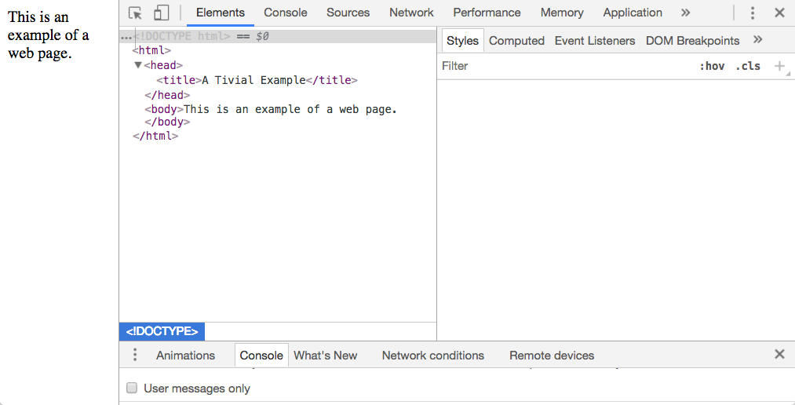

```{r setup, include=FALSE}
knitr::opts_chunk$set(echo = TRUE)
```

## Introduction

Quosures enable *Programming on the Language*. This tutorial looks at how they
do that.

*Programming on the Language* is a way of circumventing R's standard evaluation of an
expression and instead use your own code to interpret that expession and then use
that interpretation to perform what ever operations you want. This is called
non-standard evaluation or NSE. Its done to embded
a custom programming langage inside of an R expression.

An example
of this is dplyr::filter which implements a simple programming language for
choosing rows from a table that is more straightforward than the R programming language
for doing that. For example:

```{r simplefilter}
suppressPackageStartupMessages(library(dplyr))
tbl <- tibble::tribble(
	~length, ~width, ~weight,
	10, 20, 110,
	15, 10, 87,
	12, 30, 92,
	15, 20, 99
)
# R language for a filter
tbl[tbl["weight"] < 94 & tbl["length"] > 12, ]
# dplyr language for a filter
filter(tbl, weight < 94, length > 12)
```

The R standard evaluation syntax for a filter 
has more of what is sometimes called *programming ceremony*
than the dplyr syntax. Programming ceremony is the text you need
to type into an expression that has little to do with telling R you what it is
want expression to do.

In the R standard evaluation syntax in this example the
programing ceremony is `tbl` repeated three times, the quotes and square
brackets and even that one *dangling* comma. All of those things are necessary
to get the filter to do what you want it to do but do nothing to clarify what
you want the filter to do. Get one of those pieces of ceremony wrong and only
if you are lucky you will get an error... if you are unlucky the statement will
just silently produce incorrect data.

`dplyr::filter` circumvents the R standard evaluation of its second and third
arguments in this example. It interprets the expressions `weight < 94` 
and `length > 12` with it's own code to associate them with `tbl` and produce the same results 
as the R standard filter.

Here dplyr::filter is using NSE to embed its own programing language for describing how to 
choose rows in a table.

One of the powerful things about using NSE like this is that in many cases, maybe most,
you don't need to know how NSE works, or even that quosures exist, to make use
of an embeded custom language. One of
these cases is when you are using functions that use NSE, like `dplyr::filter`,
from the command line to explore data.

But if you are using NSE functions in a script or you are implementing your own
custom language then you will need to understand how NSE functions work.

And even if you are using it from the command line you may run into edge cases
where a good understanding of how NSE functions will be a big help.


##Language  Operational Components

Language operational components isn't a term from Computer Science, it just, I 
think, describes the parts of a language in terms of how a program, for example written
in the R language, produces its results.

*Programming on the Language* means inspecting, managing and sometimes 
manipulating the language operational components of the R. Quosuers
give you access to these components.

In R, and most programming langauges, you will find three operational components;
Syntax, model and context. Let's take a look at what each is before we go into 
details.

The syntax of a language determines what you are allowed to type when you
write a program. In R, for example you can type

```{r allowed}
a <- 2
b <- 3
# this is allowed in an R program
a + b
```
and R can understand it and process it. But if you type

```{r notallowed, error=TRUE}
# this is not allowed in an R program
+ a b
```

R won't even try to figure out what you are trying to tell it. This happens
because R checks that what you have typed complies with the syntax of R before
it tries to do anything else.

This means that the custom language you are trying to embed inside an R 
expression must comply with the syntax rules for R.

The syntax of a language can be documented in many ways. For R this is done
in Section 10 of the *R Language Definition* 
https://cran.r-project.org/doc/manuals/r-release/R-lang.pdf .

The syntax of a language like R is meant to give people a familiar way to express
what they want a computer to do by writing an English prose-like list of 
directions. In R each one of these directions is called an expression. A big
factor in how useful a programming language is for a particular task is
its syntax. 

However the computer cannot directly understand prose of a programming langauge.
It has to be translated 
into a model the computer can understand directly. I'm going to give that 
model the name *Expression Object Model*. Later you will see why I chose
this name. The *Expression Object Model* is an in memory represenation of an
expression from the programing language and is built
out of objects defined by the implementation of the language.

There can be more than one *Expression Object Model* for a langauge. In R there is one
defined in the c language implementation of R. But another is defined by the rlang 
package... that's the one we'll be using in this tutorial.

What can R do with an *Expression Object Model*? The main thing is to evaluate
it. Evaluation produces a result that can be one or maybe more numbers. Keep
in mind that a string, under the covers, is just a sequence of numbers. When you
run an R program you get back the result of R evaluating the *Expession Object Model*
of each of the expressions in that program.

The evaluation of an *Expression Object Model* is where the context is involved.
Programs are mostly written with symbols that represent values of some kind.

For example in this trivial R program:

```{r trival}
a <- 2
b <- 3
a + b
```

`a` and `b` are symbols. When R goes to sum up those two symbols it has to somehow
find out what their values are. It does this by looking up those symbols in
the context where that evaluation is being done.

In R this context is called an environment. In fact in R the context may be
sequence of multiple environments that R goes through when it needs, or creates,
the value of a symbol.

The `rlang` package implements an *Expression Object Model* of R. A quosure contains
that in memory repesentation of the model. In fact the `rlang` psckage is a wrapper around
the `c` language memory model that R uses to evaluate expressions.

A quosue gives you access to all three of these language operational
components.

The big picture of what we just covered is that a person uses the syntax of R
to write an expression which in turn is translated into in memory model of that expression,
called an *Expression Object Model*. Then R evaluates the *Expression Object Model*
in a context and produces a result.

# An Analog to Quosures

So far the explanation of quosures and how they can be used to change how R interprets
its syntax is a bit on the abstract side. A lot of R users are familar, to some
extent, with html. html is a language, a markup language and it has language
operational components just like R does. However in html it's a lot easier to 
see the html's equivalent of an *Expression Object Model* in concrete terms.
So let's do that.

Here is a trival example of an HTML page. It's in `trivial.html` from the 
files you can download for this tutorial.

```
<!DOCTYPE html>
<title>A Tivial Example</title>
This is an example of a valid web page.
```

At first glance you might think that this is not a valid web page because it seems
to be missing many tags you might think are required. For example the is no
`<html>` tag

If you open the `trivial.html` file in your web browser it will display properly.
However opening a file is not a test for html validity... no browsers check html for
validity and will display almost anything given to them.

However if you go to the W3C web page for checking the validity of html at
https://validator.w3.org/#validate_by_input and check this example there you will
find that the syntax, one of the operational components of html, of this page
is correct.

The syntax for html is defined on the W3C site at https://www.w3.org/TR/html51/ . If you 
dig into it (please don't, it's pretty overwhelming :-)  you will find that many tags
are optional, not required, for example the `<html>` tag https://www.w3.org/TR/html51/semantics.html#the-html-element

So where might you have gotten the idea that the `html` tag and friends are required? It's
probably becasue you more familar with the model component of html than with it's syntax.

The W3C calls the model component of html the Document Object Model or DOM. That's where
I got the idea of calling the model component of R expresions the
*Expression Object Model*. It's located at
https://www.w3.org/TR/2003/REC-DOM-Level-2-HTML-20030109/ . 

The DOM defines a number of objects that can be used to represent html in
memory, just as the `rlang` package does.

Here is an example of the tool that Chrome provides for exploring the DOM, the
equivalent of the *Expression Object Model* for R.



Notice that the *missing* tags seem to have appeared! Actually what you see are
not tags, the are markers that represent objects used in the in memory model of the html for the page.

There are some utilitarian differences between the W3C DOM and the `rlang` 
packages. The W3C formally defines the model component of html and the `rlang`
package does not. Also out there in 
the wild that are a lot of tools for visually exploring the DOM. In R we don't have
comprehensive tools  to visually explore a quosure.

html, not the DOM, is designed to build a static web page. In classic html the
only way to "liven" up a page by making it change, 
except for some simpistic changes like a drop down menu,
is to request the web site that
originally served up the page to send a new page to the 
browser.

The way you make a dynamic web page, for example the way Shiny does, is to
add some javascript to the page. That javascript examines and manipulates the
DOM, not the html, for the page. When you use javascript like this you are "programming on the langauge", the hypertext markup language.

With a quosure you can "program on the language" with the R langauge. The usage details are different but "programming on the langauge" in R is the same thing
as using javascript with html to make dynamic web pages my maipulating
the DOM.

##Components in Action

Before we go further and with only minimal explanation of the code, let's look
at some examples of quosures that use the language operational components in
action. These examples are only meant to show what can be accompished with quosures, the programming details of how this is done is covered later in the tutorial.

###Complexity Measure, Using Syntax

Here is a function that measures the complexity of an expression. It's metric is
pretty simple, the longer the expression the more complex it is. However this 
function needs to access the expression itself, *i.e.* the string the syntax allows,
in order to implement this metric and it uses a quosure to do this.

```{r complexity}
complexity <- function(expr) {
	# make a quosure of the expression
	q <- rlang::enquo(expr)
	# since a quosure mimics a formula we can get it's text
	stringr::str_length(rlang::f_text(q))
}

complexity(a)
complexity(a + b)
```

So our `complexity` function shows that `a + b` is five times more  complicated
than `a` :-) .

The important thing shown here is that we were able to access the argument of `complexity`
as a string and then process that string any way we please. In this case we just got
it length but, of course, we could have done much more with it.

However there is limitation here. It's not a deal breaker but in the general case
it's pretty significant. The argument of complexity has to be a string that is
allowed by R's syntax. For example you might like use our `complexity` function to
measure the complexity of a lisp expression like this:
```{r, error=TRUE}
complexity((+ a b))
```

As you can see our complexity function never even got to look at the lisp expression
that was passed into it. That's because the first thing R does when a function
is called is to check that each argument is allowed by the R language syntax. If one is not R doesn't go any further and just returns an error.

###Bizzaro World Arithmetic, Using Context

In this example we implement Bizzarro World ( https://en.wikipedia.org/wiki/Bizarro_World ) arithmetic. In
Bizzaro World add means subtract, multiple means divide and *vica versa*.

```{r bizzarro}

barithmetic <- function(expr) {
	q <- rlang::enquo(expr)
	# get the context of the quosure
	context <- new.env()
	# change arithmetic function definition to bizzarro arithmetic
	# in the context of the quosure
	# note that this doesn't change these definitions anywhere else
	context$`+` <- function(x,y) {x - y}
	context$`-` <- function(x,y) {x + y}
	context$`*` <- function(x,y) {x / y}
	context$`/` <- function(x,y) {x * y}
	# to the evaluation in Bizzarro World
	rlang::eval_tidy(q, context)
}

calc1 <- barithmetic(3 + 1)
# Hmmmm???
calc1
calc2 <- barithmetic(3 * 4 + 1)
#yikes!!!!
calc2
```

Here, by manipulating the context component we were able to 
substitute bizzarro arithmetic for regular arithmetic. Next we're going to change ggplot2 to use non-Euclidian geometry for it's plots... 
ha, ha, just kidding :-).

### Bizzarro World Arithmetic again, Using Model

Now we are going to use the model of R expressions that the `rlang` package uses,
to implement bizzarro arithmetic. This example is going use some of the code
from the files that can be downloaded for this tutorial. The details of how the
functions in this code work won't be explained in any detail 
until later in this tutorial.

What the barithmetic function does in this example is extract the
model the `rlang` package uses for expressions from a quosure then searches it for
all the aritmetic operators in it, that is +, -, *, and /, and flip each one to
it's bizzarro world version.

After the operators have been flipped barithmetic uses R to evaluate the
quosure and produce a bizzarro result.

```{r}
suppressPackageStartupMessages(library(quotools))
suppressPackageStartupMessages(library(tidyverse))
suppressPackageStartupMessages(library(magrittr))

# table of operators that are flipped in
# the bizzarro world
op_table <- tibble::tribble(
	~ op, ~ bizzarro_op,
	"+", "-",
	"-", "=",
	"*" , "/",
	"/", "*"
)

# uses op_table to flip arithmetic operators
# in the bizzarro world
bizzarro_flip <- function(q) {
	ast <- qtls_make_ast_table(q) %>%
		dplyr::filter(expr_property == "car")
	purrr::walk(ast$expression, function(expr) {
		car <- rlang::node_car(expr)
		if (rlang::is_symbol(car)) {
			bizzarro_op <- dplyr::filter(op_table, op == car)$bizzarro_op
			if (bizzarro_op != "") {
				rlang::mut_node_car(expr, rlang::sym(bizzarro_op))
			}
		}
	})
}

barithmetic <- function(expr) {
	q <- rlang::enquo(expr)
	bizzarro_flip(q)
	rlang::eval_tidy(q)
}

# hmmm??
barithmetic(3 + 1)
# yikes!!
barithmetic(3 * 4 + 1)
```

Same bizzarro results, but this time we bizzarro'd all the arithmetic operators
in the expression and then let R do the evaluation... that's what rlang::eval_tidy
does.

The function `qtls_make_ast_table` converts the model of an R expession that 
the `rlang` packages uses into a tabular form of an abstract syntax table, or
AST. We'll learn more about AST's later but having one in tablular form lets you apply
your R table processing
knowlege and minimizes the amount of "detail" knowledge of how to access
parts of the `rlang` model of expressions.


Here is what that table looks like for the 
second bizzarro calculation we did.

```{r}
suppressPackageStartupMessages(library(quotools))
show_model_table <- function(expr) {
	q <- rlang::enquo(expr)
	print(qtls_make_ast_table(q))
}
show_model_table(3 * 4 + 1)

```


Notice that this  table is represents a tree by using the `id` and `parent` 
columns. The row with a 0 parent is the root of the tree.

Some rows represent objects in the abstract syntax tree, or AST,
that R uses to evaluate an expression and other rows represent intermediate
objects used in building the AST.

Don't worry if the model table doesn't make a lot of sense yet, it will covered 
later in this tutorial.

These examples don't even begin to cover all the ways and thing you can do by 
*programming on the language" with quosures. But they do show that you can 
access the data in a quosure and do what every you want to do with the 
data inside of it.

##`rlang` Model

At first glance it seems that the `rlang` model of an R expression is pretty
straightforward. It's often described as a tree structure... like this for 
an the simple expression like: `a * b + c * d`

```{r simpleexp}
suppressPackageStartupMessages(library(tidyverse))
suppressPackageStartupMessages(library(quotools))
suppressPackageStartupMessages(library(DiagrammeR))
q <- rlang::quo(a * b + 2 * d )
ast_tbl <- qtls_make_rlang_table(q)
g <- qtls_plot_ast(ast_tbl)
DiagrammeR::render_graph(g, layout = "tree")
```

What you see here is a visualization of the 

However this diagram does not a representation of model `rlang` uses for expressions.


